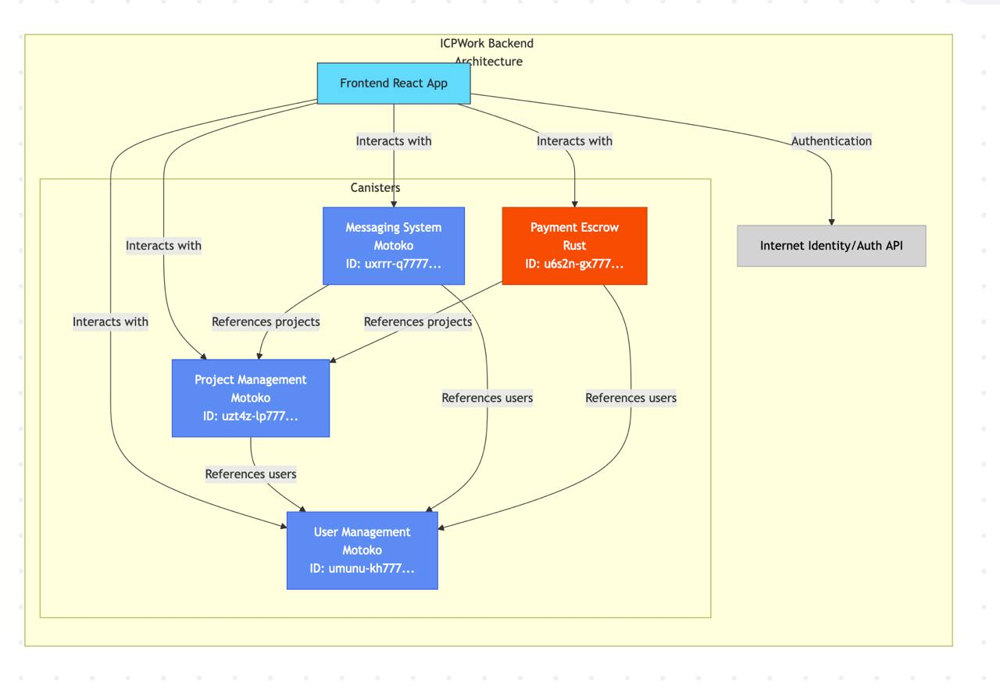

# ICP Backend Documentation

## Table of Contents
- [Overview](#overview)
- [Architecture](#architecture)
- [Canister Structure](#canister-structure)
- [Setup Instructions](#setup-instructions)
- [API Documentation](#api-documentation)
  - [User Management](#user-management)
  - [Project Management](#project-management)
  - [Messaging System](#messaging-system)
  - [Payment Escrow](#payment-escrow)
- [Integration Examples](#integration-examples)
- [Best Practices](#best-practices)
- [Troubleshooting](#troubleshooting)

## Overview

This document provides comprehensive documentation for the ICP (Internet Computer Protocol) backend system. The backend consists of four main canisters that handle user management, project management, messaging, and payment escrow functionalities for a freelance marketplace platform.

## Architecture

The backend is built on the Internet Computer Protocol (ICP) using a combination of Motoko and Rust programming languages. The system follows a microservices-like architecture where each core domain has its own canister:



The four primary canisters are:
1. **User Management**: Handles user accounts, profiles, and authentication
2. **Project Management**: Manages projects, proposals, and project lifecycle
3. **Messaging System**: Provides communication functionality between users
4. **Payment Escrow**: Handles secure financial transactions and escrow services

## Canister Structure

### Canister IDs (Local Development)

```
messaging_system: http://127.0.0.1:4943/?canisterId=ulvla-h7777-77774-qaacq-cai&id=uxrrr-q7777-77774-qaaaq-cai
payment_escrow: http://127.0.0.1:4943/?canisterId=ulvla-h7777-77774-qaacq-cai&id=u6s2n-gx777-77774-qaaba-cai
project_management: http://127.0.0.1:4943/?canisterId=ulvla-h7777-77774-qaacq-cai&id=uzt4z-lp777-77774-qaabq-cai
```

For production deployment, you would replace these with your mainnet canister IDs.

## Setup Instructions

### Prerequisites
- [dfx](https://sdk.dfinity.org/) (DFINITY Canister SDK) installed
- Node.js and npm installed
- Rust installed (for payment escrow canister)

### Local Development Setup

1. Clone the repository:
   ```bash
   git clone [repository-url]
   cd [repository-directory]
   ```

2. Install dependencies:
   ```bash
   npm install
   ```

3. Start the local ICP replica:
   ```bash
   dfx start --background
   ```

4. Deploy the canisters locally:
   ```bash
   dfx deploy
   ```

5. The canister URLs will be displayed in the terminal, or you can find them in the `canister_names.txt` file.

### Production Deployment

1. Prepare for production deployment:
   ```bash
   dfx canister create --network ic
   ```

2. Deploy to the IC mainnet:
   ```bash
   dfx deploy --network ic
   ```

3. Record your production canister IDs for frontend integration.

## API Documentation

### User Management

The User Management canister handles user profiles and authentication.

#### Data Structures

```motoko
public type User = {
    id: Principal;
    username: Text;
    email: Text;
    skills: [Text];
    bio: Text;
    rating: Float;
    created_at: Int;
    is_verified: Bool;
};
```

#### API Methods

| Method | Description | Parameters | Return Type |
|--------|-------------|-----------|------------|
| `createUser` | Create a new user profile | `username: Text, email: Text, skills: [Text], bio: Text` | `Result.Result<User, UserError>` |
| `getUser` | Fetch user profile by ID | `user_id: Principal` | `Result.Result<User, UserError>` |
| `updateUser` | Update user profile | `username: Text, email: Text, skills: [Text], bio: Text` | `Result.Result<User, UserError>` |
| `getAllUsers` | Fetch all users | None | `[User]` |
| `updateRating` | Update user's rating | `user_id: Principal, new_rating: Float` | `Result.Result<User, UserError>` |
| `verifyUser` | Set user as verified | `user_id: Principal` | `Result.Result<User, UserError>` |

#### JavaScript API Example

```javascript
import { userManager } from './api/icp';

// Create user
const createUserProfile = async (identity) => {
  try {
    const result = await userManager.createUser(
      "username",
      "email@example.com",
      ["JavaScript", "React", "Node.js"],
      "Software developer with 5 years of experience",
      identity
    );
    console.log("User created:", result);
    return result;
  } catch (error) {
    console.error("Error creating user:", error);
  }
};

// Get user profile
const getUserProfile = async (userId, identity) => {
  try {
    const result = await userManager.getUser(userId, identity);
    console.log("User profile:", result);
    return result;
  } catch (error) {
    console.error("Error getting user:", error);
  }
};
```

### Project Management

The Project Management canister handles project listings, proposals, and project lifecycle.

#### Data Structures

```motoko
public type Project = {
    id: Nat;
    title: Text;
    description: Text;
    budget: Nat;
    category: Text;
    skills_required: [Text];
    client_id: Principal;
    freelancer_id: ?Principal;
    status: ProjectStatus;
    created_at: Int;
    updated_at: Int;
};

public type Proposal = {
    id: Nat;
    project_id: Nat;
    freelancer_id: Principal;
    bid_amount: Nat;
    delivery_time: Nat;
    cover_letter: Text;
    status: ProposalStatus;
    created_at: Int;
};
```

#### API Methods

| Method | Description | Parameters | Return Type |
|--------|-------------|-----------|------------|
| `createProject` | Create a new project | `title: Text, description: Text, budget: Nat, category: Text, skills_required: [Text]` | `ProjectResult` |
| `getProject` | Fetch project details | `project_id: Nat` | `ProjectResult` |
| `getAllProjects` | Fetch all projects | None | `[Project]` |
| `getClientProjects` | Fetch projects by client | `client_id: Principal` | `[Project]` |
| `getFreelancerProjects` | Fetch projects by freelancer | `freelancer_id: Principal` | `[Project]` |
| `updateProjectStatus` | Update project status | `project_id: Nat, status: ProjectStatus` | `ProjectResult` |
| `submitProposal` | Submit proposal for a project | `project_id: Nat, bid_amount: Nat, delivery_time: Nat, cover_letter: Text` | `ProposalResult` |
| `getProposal` | Fetch proposal details | `proposal_id: Nat` | `ProposalResult` |
| `getProjectProposals` | Fetch all proposals for a project | `project_id: Nat` | `[Proposal]` |
| `getFreelancerProposals` | Fetch all proposals by a freelancer | `freelancer_id: Principal` | `[Proposal]` |
| `acceptProposal` | Accept a proposal | `proposal_id: Nat` | `Result.Result<(Proposal, Project), Text>` |

#### JavaScript API Example

```javascript
import { projectManager } from './api/icp';

// Create a new project
const createNewProject = async (identity) => {
  try {
    const deadline = new Date();
    deadline.setDate(deadline.getDate() + 30); // 30 days from now
    
    const result = await projectManager.createProject(
      "Build a React Native App",
      "Looking for a developer to build a mobile app with React Native",
      10000, // budget in tokens
      ["React Native", "JavaScript", "Mobile Development"],
      deadline,
      identity
    );
    console.log("Project created:", result);
    return result;
  } catch (error) {
    console.error("Error creating project:", error);
  }
};

// Submit a proposal for a project
const submitProjectProposal = async (projectId, identity) => {
  try {
    const result = await projectManager.submitProposal(
      projectId,
      8500, // bid amount in tokens
      "I'm an experienced React Native developer with 3+ years of experience",
      14, // estimated duration in days
      identity
    );
    console.log("Proposal submitted:", result);
    return result;
  } catch (error) {
    console.error("Error submitting proposal:", error);
  }
};
```

### Messaging System

The Messaging System canister enables communication between users.

#### Data Structures

```motoko
public type Message = {
    id: Nat;
    sender_id: Principal;
    receiver_id: Principal;
    content: Text;
    read: Bool;
    thread_id: Nat;
    timestamp: Int;
};

public type Thread = {
    id: Nat;
    user1_id: Principal;
    user2_id: Principal;
    last_message_time: Int;
};
```

#### API Methods

| Method | Description | Parameters | Return Type |
|--------|-------------|-----------|------------|
| `createThread` | Create a new conversation thread | `other_user_id: Principal` | `ThreadResult` |
| `sendMessage` | Send a message to another user | `receiver_id: Principal, content: Text` | `MessageResult` |
| `getMessage` | Fetch a specific message | `message_id: Nat` | `MessageResult` |
| `markMessageAsRead` | Mark a message as read | `message_id: Nat` | `MessageResult` |
| `getThreadMessages` | Fetch all messages in a thread | `thread_id: Nat` | `MessagesResult` |
| `getUserThreads` | Fetch all threads for a user | `user_id: Principal` | `[Thread]` |
| `getUnreadMessageCount` | Get count of unread messages | `user_id: Principal` | `Nat` |

#### JavaScript API Example

```javascript
import { messagingSystem } from './api/icp';

// Create a thread with another user
const createMessageThread = async (otherUserId, identity) => {
  try {
    const result = await messagingSystem.createThread(
      "Project Discussion",
      [otherUserId],
      null, // No related project yet
      identity
    );
    console.log("Thread created:", result);
    return result;
  } catch (error) {
    console.error("Error creating thread:", error);
  }
};

// Send a message to another user
const sendUserMessage = async (threadId, receiverId, identity) => {
  try {
    const result = await messagingSystem.sendMessage(
      threadId,
      receiverId,
      "Hello, I'm interested in your project. Can we discuss further?",
      identity
    );
    console.log("Message sent:", result);
    return result;
  } catch (error) {
    console.error("Error sending message:", error);
  }
};

// Get messages in a thread
const getThreadConversation = async (threadId, identity) => {
  try {
    const result = await messagingSystem.getThreadMessages(threadId, identity);
    console.log("Thread messages:", result);
    return result;
  } catch (error) {
    console.error("Error getting thread messages:", error);
  }
};
```

### Payment Escrow

The Payment Escrow canister handles secure payment transactions between users.

#### Data Structures

```rust
pub struct Payment {
    id: u64,
    project_id: u64,
    client_id: Principal,
    freelancer_id: Principal,
    amount: u64,
    status: PaymentStatus,
    created_at: u64,
    updated_at: u64,
}

pub enum PaymentStatus {
    Pending,
    Funded,
    Released,
    Refunded,
    Disputed,
}
```

#### API Methods

| Method | Description | Parameters | Return Type |
|--------|-------------|-----------|------------|
| `create_escrow` | Create a new escrow payment | `project_id: u64, freelancer_id: Principal, amount: u64` | `Result<u64, EscrowError>` |
| `deposit_to_escrow` | Fund an escrow payment | `payment_id: u64` | `Result<Payment, EscrowError>` |
| `release_payment` | Release funds to freelancer | `payment_id: u64` | `Result<Payment, EscrowError>` |
| `refund_payment` | Refund payment to client | `payment_id: u64` | `Result<Payment, EscrowError>` |
| `dispute_payment` | Mark payment as disputed | `payment_id: u64` | `Result<Payment, EscrowError>` |
| `get_payment` | Get payment details | `payment_id: u64` | `Result<Payment, EscrowError>` |
| `get_payments_by_client` | Get all payments by client | `client_id: Principal` | `Vec<Payment>` |
| `get_payments_by_freelancer` | Get all payments by freelancer | `freelancer_id: Principal` | `Vec<Payment>` |
| `get_payments_by_project` | Get all payments for a project | `project_id: u64` | `Vec<Payment>` |

#### JavaScript API Example

```javascript
import { paymentEscrow } from './api/icp';

// Create an escrow payment
const createProjectEscrow = async (projectId, freelancerId, amount, identity) => {
  try {
    const result = await paymentEscrow.createEscrow(
      projectId,
      freelancerId,
      amount,
      identity
    );
    console.log("Escrow created:", result);
    return result;
  } catch (error) {
    console.error("Error creating escrow:", error);
  }
};

// Release payment to freelancer
const releaseEscrowPayment = async (paymentId, identity) => {
  try {
    const result = await paymentEscrow.releasePayment(paymentId, identity);
    console.log("Payment released:", result);
    return result;
  } catch (error) {
    console.error("Error releasing payment:", error);
  }
};
```

## Integration Examples

### Complete Project Workflow

Here's an example of integrating multiple canisters to create a complete project workflow:

```javascript
import { userManager, projectManager, messagingSystem, paymentEscrow } from './api/icp';
import { AuthClient } from '@dfinity/auth-client';

// Get the user's identity
const getIdentity = async () => {
  const authClient = await AuthClient.create();
  if (await authClient.isAuthenticated()) {
    return authClient.getIdentity();
  }
  return null;
};

// Complete project workflow
const completeProjectWorkflow = async () => {
  try {
    const identity = await getIdentity();
    if (!identity) {
      console.error("User not authenticated");
      return;
    }
    
    // Step 1: Create a project
    const project = await projectManager.createProject(
      "Develop E-commerce Website",
      "Need a full-stack developer to build an e-commerce platform",
      20000,
      ["React", "Node.js", "MongoDB"],
      new Date(Date.now() + 60 * 24 * 60 * 60 * 1000), // 60 days from now
      identity
    );
    console.log("Project created:", project);
    
    // Step 2: Freelancer submits proposal (would be done by another user)
    // This is just for demonstration
    const proposal = await projectManager.submitProposal(
      project.id,
      18000,
      "I can deliver a high-quality e-commerce platform",
      45, // 45 days estimated
      identity // In real scenario, this would be the freelancer's identity
    );
    console.log("Proposal submitted:", proposal);
    
    // Step 3: Client accepts proposal
    const accepted = await projectManager.acceptProposal(proposal.id, identity);
    console.log("Proposal accepted:", accepted);
    
    // Step 4: Create escrow payment
    const paymentId = await paymentEscrow.createEscrow(
      project.id,
      proposal.freelancer_id,
      proposal.bid_amount,
      identity
    );
    console.log("Escrow created:", paymentId);
    
    // Step 5: Client funds the escrow
    const fundedPayment = await paymentEscrow.depositToEscrow(paymentId, identity);
    console.log("Escrow funded:", fundedPayment);
    
    // Step 6: Client and freelancer communicate
    const thread = await messagingSystem.createThread(
      "Project Discussion",
      [proposal.freelancer_id],
      project.id,
      identity
    );
    console.log("Thread created:", thread);
    
    const message = await messagingSystem.sendMessage(
      thread,
      proposal.freelancer_id,
      "Let's discuss the project requirements in detail",
      identity
    );
    console.log("Message sent:", message);
    
    // Step 7: After project completion, release payment
    // This would happen after the freelancer delivers the work
    const releasedPayment = await paymentEscrow.releasePayment(paymentId, identity);
    console.log("Payment released to freelancer:", releasedPayment);
    
    // Step 8: Mark project as complete
    const completedProject = await projectManager.completeProject(project.id, identity);
    console.log("Project marked as complete:", completedProject);
    
    return {
      project,
      proposal,
      payment: releasedPayment,
      thread
    };
  } catch (error) {
    console.error("Error in project workflow:", error);
  }
};
```

## Best Practices

### Identity Management

- Always pass the user's identity to the API functions to ensure proper authentication
- Store the authentication state securely in your frontend application
- Implement proper session management for users

### Error Handling

- Implement comprehensive error handling for all API calls
- Use try/catch blocks to handle exceptions
- Provide meaningful error messages to users

### Security

- Never expose sensitive information in the frontend code
- Implement proper role-based access control in your application
- Regularly audit and update your canister code

### Performance

- Minimize update calls and prefer query calls when possible
- Batch operations when appropriate
- Consider pagination for large data sets

## Troubleshooting

### Common Issues

1. **Authentication Errors**
   - Ensure the user is properly authenticated
   - Check that the correct identity is being passed to API functions

2. **Canister Not Found**
   - Verify that the canister IDs are correct in your environment
   - Check that the canisters are deployed and running

3. **Permission Denied**
   - Ensure the calling principal has the necessary permissions
   - Check role-based access control settings

4. **Transaction Failures**
   - Ensure sufficient cycles for the operation
   - Check that all required parameters are provided correctly

### Debugging Tips

1. Use the Candid UI to inspect canister state and test functions directly
2. Enable verbose logging in your frontend application
3. Check the dfx output logs for backend errors
4. Use browser developer tools to inspect network requests and responses

For additional support, refer to the ICP documentation or contact the development team.
