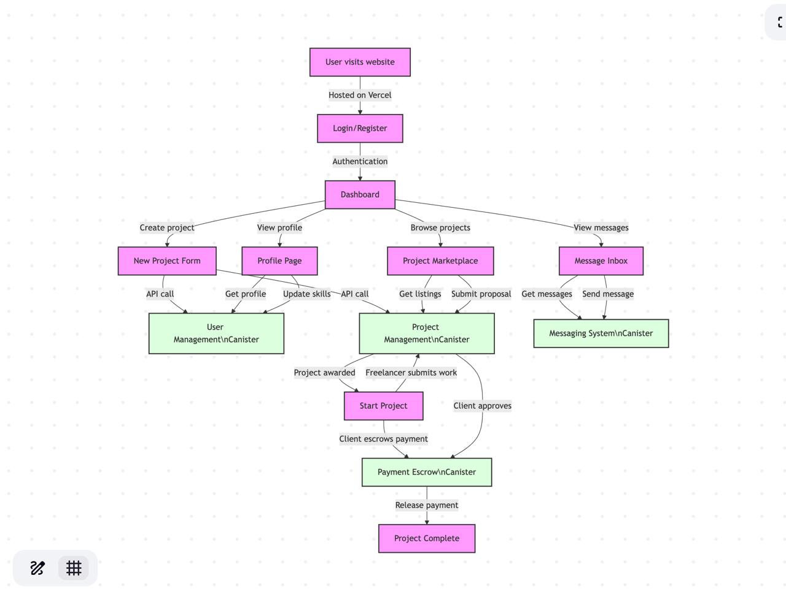

# ICPWork Whitepaper

## A Decentralized Freelancing Platform on the Internet Computer Protocol

**Version 1.0 | July 2025**

---

## Executive Summary

ICPWork is a next-generation decentralized freelancing platform built on the Internet Computer Protocol (ICP). By leveraging blockchain technology, ICPWork eliminates intermediaries, reduces fees, and creates a trustless environment for connecting clients with freelancers globally. Our platform prioritizes security, transparency, and efficiency through smart contract canisters that handle user management, project workflows, secure messaging, and payment escrow services.

This whitepaper outlines the technical architecture, tokenomics, governance model, and roadmap for ICPWork, demonstrating how it addresses the challenges of traditional freelance marketplaces through decentralized technology.

---

## Table of Contents

1. [Introduction](#1-introduction)
2. [Market Analysis](#2-market-analysis)
3. [Platform Architecture](#3-platform-architecture)
4. [Technical Implementation](#4-technical-implementation)
5. [User Experience & Workflow](#5-user-experience--workflow)
6. [Tokenomics & Incentive Structure](#6-tokenomics--incentive-structure)
7. [Security Measures](#7-security-measures)
8. [Governance Model](#8-governance-model)
9. [Roadmap & Future Development](#9-roadmap--future-development)
10. [Team & Advisors](#10-team--advisors)
11. [Conclusion](#11-conclusion)
12. [References & Appendices](#12-references--appendices)

---

## 1. Introduction

### 1.1 The Vision
ICPWork aims to disrupt the $455 billion freelance marketplace industry by eliminating the 20-30% commission fees charged by centralized platforms, enhancing payment security, and providing immutable reputation systems built on blockchain technology.

### 1.2 The Problem
Traditional freelancing platforms suffer from:
- High transaction fees (20-30% of project value)
- Payment delays and security concerns
- Centralized control of user data and reputation
- Platform dependency and lock-in
- Lack of transparency in dispute resolution

### 1.3 The Solution
ICPWork leverages the Internet Computer Protocol to create:
- A trustless escrow system for secure payments
- Immutable reputation tracking
- Decentralized governance and dispute resolution
- Transparent fee structure (3-5%)
- User ownership of data and reputation

---

## 2. Market Analysis

### 2.1 Freelancing Market Size
- Global freelance market size: $455 billion (2023)
- Expected CAGR: 15.3% (2023-2028)
- Digital freelancers: 1.57 billion worldwide (28% of global workforce)

### 2.2 Blockchain Adoption
- Web3 developers: 23,343 monthly active (2024)
- Decentralized application users: 4.8 million monthly active
- ICP ecosystem growth: 60,000+ developers, 2,000+ applications

### 2.3 Competitive Landscape
Analysis of competitors including:
- Traditional platforms (Upwork, Fiverr, Freelancer)
- Blockchain-based alternatives (LaborX, Ethlance)
- ICP ecosystem projects

### 2.4 Market Opportunity
ICPWork is positioned to capture market share through:
- Lower fees (3-5% vs 20-30%)
- Enhanced security features
- Blockchain-native reputation system
- Integration with Web3 ecosystem

---

## 3. Platform Architecture

### 3.1 System Overview

ICPWork is built on a modular canister-based architecture that separates concerns into four primary smart contract canisters:

1. **User Management Canister**: Handles user identity, profiles, skills, verification, and reputation
2. **Project Management Canister**: Manages project listings, proposals, milestones, and deliverables
3. **Messaging System Canister**: Enables secure, encrypted communication between parties
4. **Payment Escrow Canister**: Secures funds and handles controlled release based on project completion

*Figure 1: ICPWork Platform Architecture*

### 3.2 Technology Stack

- **Backend**: Internet Computer Protocol (ICP) canisters
  - Motoko language for user, project, and messaging canisters
  - Rust for the payment escrow canister (enhanced security)
- **Frontend**: React.js with Vite, deployed on Vercel
- **Authentication**: Internet Identity integration
- **API Layer**: @dfinity/agent for canister communication

### 3.3 Data Flow and Communication

The system implements a secure cross-canister communication protocol that enables seamless interactions while maintaining data integrity and user privacy. All critical operations generate immutable audit trails on the blockchain.

---

## 4. Technical Implementation

### 4.1 Canister Architecture

#### 4.1.1 User Management Canister
- Identity verification and management
- Profile creation and updates
- Skill verification and certification
- Reputation scoring and history
- Privacy controls and data ownership

#### 4.1.2 Project Management Canister
- Project creation and listing
- Proposal submission and review
- Milestone tracking and approval
- Deliverable management
- Dispute flagging

#### 4.1.3 Messaging System Canister
- Secure message storage and retrieval
- Thread management
- Read receipts and notifications
- File sharing capabilities
- Message encryption

#### 4.1.4 Payment Escrow Canister
- Multi-currency support (ICP, BTC, ETH, USDC)
- Milestone-based payment release
- Dispute resolution mechanisms
- Transaction history and reporting
- Fee distribution logic

### 4.2 Technical Advantages of ICP

- **Chain-Key Cryptography**: Enables secure user authentication
- **Autonomous Canisters**: Self-governing smart contracts with their own state
- **Web Speed**: ~1-2s for update calls, ~250ms for query calls
- **HTTP Interface**: Direct frontend-to-canister communication without middleware
- **Reverse Gas Model**: Platform pays for computation, not users

### 4.3 Scalability Considerations

ICPWork implements horizontal sharding strategies to scale beyond initial capacity:
- User shard by username prefix
- Project shards by category and region
- Message shards by timestamp
- Inter-canister communication for data consistency

---

## 5. User Experience & Workflow

### 5.1 User Journey

The platform supports multiple user roles with tailored experiences:

*Figure 2: ICPWork User Flow Diagram*

#### 5.1.1 Client Journey
1. Registration and verification
2. Project creation with requirements specification
3. Review of freelancer proposals
4. Selection and contract confirmation
5. Milestone approval and payment release
6. Project completion and freelancer rating

#### 5.1.2 Freelancer Journey
1. Registration and skill verification
2. Profile enhancement and portfolio creation
3. Project discovery and proposal submission
4. Contract acceptance and milestone planning
5. Work submission and revision handling
6. Payment receipt and client rating

### 5.2 Key Platform Features

- **Skill-Based Matching**: AI-powered project-freelancer matching
- **Dispute Resolution**: Decentralized arbitration system
- **Reputation System**: Immutable, tamper-proof ratings
- **Secure Messaging**: End-to-end encrypted communication
- **Milestone Payments**: Granular, condition-based fund release

---

## 6. Tokenomics & Incentive Structure

### 6.1 Fee Structure
- Base platform fee: 3% (compared to 20-30% on traditional platforms)
- Optional premium services: 1-3% additional
- Fee discounts for long-term platform usage and reputation

### 6.2 Revenue Allocation
- Platform operations and development: 60%
- Community treasury: 20%
- Bug bounty program: 10%
- Governance incentives: 10%

### 6.3 Incentive Mechanisms
- Reputation-based fee discounts
- Early adopter rewards
- Referral bonuses
- Dispute resolution participation rewards

---

## 7. Security Measures

### 7.1 Smart Contract Security
- Formal verification of payment escrow canister
- Regular security audits and updates
- Bug bounty program
- Canister upgrade governance

### 7.2 User Security Features
- Two-factor authentication
- Secure key management
- Privacy controls
- Data encryption standards

### 7.3 Payment Security
- Multi-signature release mechanisms
- Escrow dispute resolution
- Transaction monitoring
- Rate limiting on sensitive operations

---

## 8. Governance Model

### 8.1 Decentralized Autonomous Organization (DAO)
- Community voting on platform upgrades
- Transparent proposal process
- Weighted voting based on platform participation
- Implementation of approved proposals

### 8.2 Dispute Resolution
- Three-tiered arbitration system
  - Automated resolution for standard cases
  - Community arbitration for complex disputes
  - Expert panel for high-value or precedent-setting cases

### 8.3 Platform Upgrades
- Open proposal submission
- Community review period
- Voting mechanisms
- Implementation and rollout procedures

---

## 9. Roadmap & Future Development

### Phase 1: Foundation (Q3 2025)
- Launch of core platform functionality
- Initial user onboarding
- Basic reputation system

### Phase 2: Growth (Q1 2026)
- Enhanced matching algorithms
- Mobile application
- Integration with additional payment methods

### Phase 3: Expansion (Q3 2026)
- Specialized marketplaces for high-demand skills
- Cross-platform identity verification
- Enhanced analytics and reporting

### Phase 4: Ecosystem (Q2 2027)
- Developer API for third-party integrations
- Specialized tooling for vertical industries
- Global expansion and localization

---

## 10. Team & Advisors

### 10.1 Core Team
[Profiles of the founding team and key personnel]

### 10.2 Advisors
[Profiles of industry advisors and technical experts]

### 10.3 Development Partners
[Key technology and implementation partners]

---

## 11. Conclusion

ICPWork represents the next evolution in freelance marketplaces by leveraging the unique capabilities of the Internet Computer Protocol to create a trustless, efficient, and user-centric platform. By eliminating intermediaries, reducing fees, and enhancing security, ICPWork aims to become the preferred platform for the growing global freelance economy.

The combination of blockchain security, decentralized governance, and user-friendly design positions ICPWork to disrupt the traditional freelance market while providing substantial benefits to both clients and freelancers worldwide.

---

## 12. References & Appendices

### 12.1 Technical References
- Internet Computer Protocol Documentation
- Motoko Programming Language Guide
- Rust Canister Development Best Practices

### 12.2 Market Research Sources
- Freelancing in America Report 2024
- Blockchain Adoption Statistics
- Global Gig Economy Analysis

### 12.3 Legal Framework
- Terms of Service
- Privacy Policy
- Dispute Resolution Procedures

---

*This whitepaper is a living document and will be updated as the ICPWork platform evolves and grows.*
